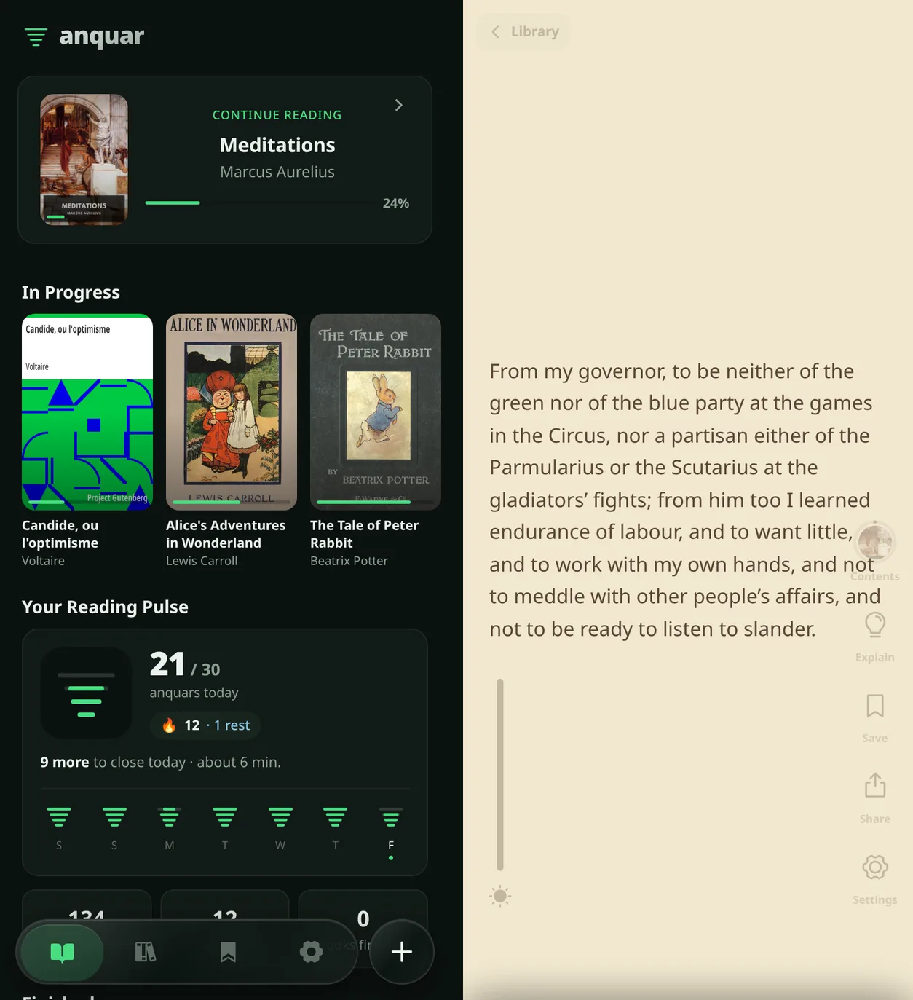

# anquar

**Guilt-free bookscrolling.** anquar turns your EPUBs into a vertical feed: one screen of a book per swipe. The thumb that knows how to doomscroll already knows how to read a chapter this way.

<p align="center">
  
</p>

The name is Amharic: **anquar** (አንኳር), the core of a thing. One card of a book is an anquar, and the app counts your reading in them.

## What it does

- **A book as a feed.** Each card fills one screen. Paragraphs stay whole where they fit, a long one breaks at a sentence, and a heading stays with what it opens. Change the type size or the margins and you land back on the words you were reading.
- **Your books, offline.** Import a DRM-free EPUB with the + button, or share one to anquar from any app on Android. Once it's installed, it reads with no connection.
- **Reading Pulse.** Your daily goal (30 anquars unless you change it) fills the mark one line at a time. Five anquars keep your streak, every seven reading days bank a rest day for one you miss (two at most), and the day ends at 4 a.m. A card counts once it has been on screen long enough to read at 600 words a minute.
- **The rail.** Contents, Explain, Save, Share and the reader's settings sit one tap from the page, with five reader themes and a brightness slider.
- **Explain.** Select a word or a passage and ask Gemini about it, with your own API key.
- **Share.** A passage goes out as an image framed by the book's cover, with the words as text below.
- **Saved.** Keep a whole card, or only the lines you selected.
- **A library you can move.** Export everything to one file and import it on another phone.

## Private by design

There's no account, no server and no telemetry. Books, places, saves and reading history live in your browser's storage on your phone. The only request that ever leaves the device is an Explain you ask for, sent to Gemini with your own key; a cover search only opens Google in your browser.

## Install

anquar is a progressive web app. In Chrome on Android, open it and choose **Install app** (or **Add to Home screen** from the menu); it then appears in the share sheet for EPUBs. On iPhone, Safari's **Share → Add to Home Screen** should work, but anquar is built and tested on Android.

## Develop

You need [Bun](https://bun.sh).

```bash
bun install
bun run dev      # http://localhost:5173 (the app is at /app/)
```

| Command | What it does |
| --- | --- |
| `bun run dev` | Starts the dev server |
| `bun run build` | Type-checks and builds to `dist/` |
| `bun run preview` | Serves the build |
| `bun run test` | Runs the tests (Vitest) |
| `bun run check` | Lints and formats with Biome, writing fixes |
| `bun run icons` | Redraws the icons, favicon and splash images from `src/brand` (needs `rsvg-convert` and ImageMagick) |

There are no environment variables: the Gemini key is entered in the app's Settings.

## How it's built

Solid.js, Vite, Tailwind CSS v4, `vite-plugin-pwa` and Dexie over IndexedDB. EPUBs are parsed in a Web Worker by [anquar-core](https://github.com/dagimg-dot/anquar-core) ([npm](https://www.npmjs.com/package/anquar-core)), which also lays the book out as cards. The architecture, storage model and reading rules are written up in [AGENTS.md](AGENTS.md).

## License

[MIT](LICENSE)
